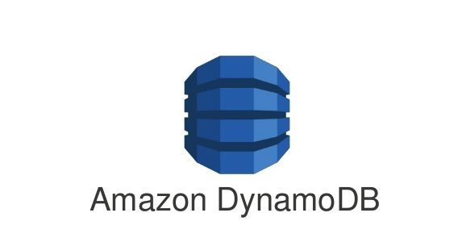

# Terraform AWS DynamoDB Table
<p align="center">
   
</p>

This Terraform configuration creates an AWS DynamoDB table named `users` in the `eu-central-1` region. The table is provisioned with a read and write capacity of 20 units each. The primary key for the table is `UserId`, a string attribute. The table is tagged with the name "users" and the environment "production".

## Prerequisites

- Terraform installed on your local machine
- AWS account with appropriate permissions

## Usage

1. **Initialize Terraform**: This command initializes the Terraform working directory, downloading the necessary providers.

   ```
   terraform init
   ```

2. **Plan the infrastructure**: This command generates and shows an execution plan.

   ```
   terraform plan
   ```

3. **Apply the configuration**: This command applies the changes required to reach the desired state of the configuration.

   ```
   terraform apply
   ```

4. **Destroy the infrastructure**: When you want to remove the resources created by this configuration, use the following command.

   ```
   terraform destroy
   ```

## Configuration Details

- **Region**: `eu-central-1`
- **DynamoDB Table Name**: `users`
- **Billing Mode**: `PROVISIONED`
- **Read Capacity**: 20
- **Write Capacity**: 20
- **Primary Key**: `UserId` (string)

## Tags

- **Name**: `users`
- **Environment**: `production`
